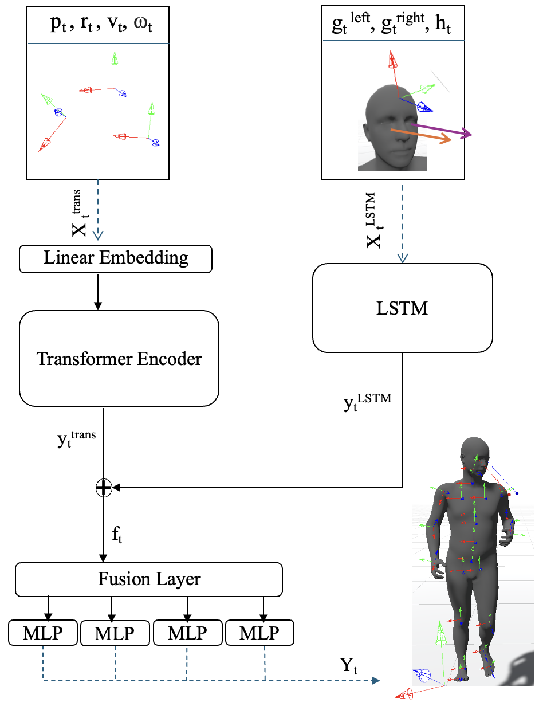

# GaMo: Gaze and Motion Dataset for Enhanced 3D Pose Estimation

*Figure: An overview of the PoseFusionNet model architecture.*

## Repository Status
🚧 This repository is currently under construction. Stay tuned for updates! 😊

---

## About
This repository accompanies the paper **"Where Does Gaze Lead? Integrating Gaze and Motion for Enhanced 3D Pose Estimation"**, which introduces the GaMo dataset and the PoseFusionNet model. The GaMo dataset integrates gaze data and human joint motion capture data, providing a comprehensive resource for 3D pose estimation, human-object interaction, and human-human interaction studies. 📊

This repository hosts:
- 🧠 The PoseFusionNet implementation.
- 🛠️ Scripts for preprocessing and analyzing motion and gaze data.
- 🎥 Videos of online and offline visualizations.

📄 **[Read the Paper](abcdefg)**  
📂 **[Download the Dataset](https://osf.io/jx54y/)**  

---

## Paper Abstract
Understanding and estimating body pose is becoming increasingly important for enhancing user experiences in Virtual Reality (VR). Eye gaze plays a critical role in many VR and Augmented Reality (AR) applications. In this work, we present GaMo, a novel dataset that integrates gaze data and human joint motion capture data, and introduce PoseFusionNet, a model that combines LSTM and Transformer architectures for enhanced 3D pose estimation. The dataset and model provide a foundation for modeling interactions between users and their surroundings with high accuracy.

---

## Dataset
The GaMo dataset contains:
- *154,212 frames* across *83 motion clips*.
-  Full-body motion capture data (41 markers per participant) recorded at 120 FPS.
- Gaze data collected using a *Tobii Eye Tracker II* 👀 synchronized with motion capture. 
-  A variety of tasks, including human-object and human-human interactions.

### Key Features:
- Diverse motion scenarios: walking, running, squatting, object manipulation, and more.
---

## Getting Started
### Requirements
- 🐍 Python 3.8+
- 🔥 PyTorch
- 📋 Additional requirements will be provided upon repository completion.

### Installation
⚙️ Instructions for setup and data usage will be added soon.

---

## Usage
- 📂 **Dataset**: Follow the dataset link above to download and use the data.
- 🖥️ **Code**: Scripts for training PoseFusionNet and analyzing results will be available.
- 🛠️ **Preprocessing**: Guidelines for synchronizing and processing motion and gaze data.

---

## License
- 📜 The code in this repository is licensed under the [MIT License](https://github.com/taravatanvari/GaMo?tab=MIT-1-ov-file).
- 📂 The GaMo dataset is licensed under the **Creative Commons Attribution 4.0 International (CC BY 4.0)** license. For details, see the [Creative Commons license page](https://creativecommons.org/licenses/by/4.0/).

---

## Citation
If you find this useful, please cite our paper :)

